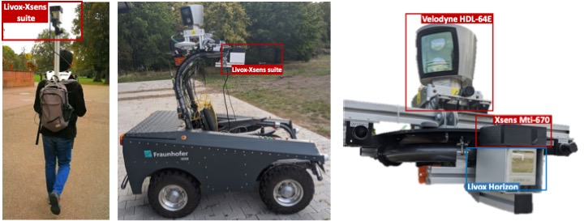

# LiLi-OM (LIvox LiDAR-Inertial Odometry and Mapping)
## -- Towards High-Performance Solid-State-LiDAR-Inertial Odometry and Mapping
This is the code repository of LiLi-OM, a real-time tightly-coupled LiDAR-inertial odometry and mapping system for solid-state LiDAR (Livox Horizon) and conventional LiDARs (e.g., Velodyne). It has two variants as shown in the folder: 

- LiLi-OM, for [Livox Horizon](https://www.livoxtech.com/de/horizon) with a newly proposed feature extraction module,
- LiLi-OM-ROT, for conventional LiDARs of spinning mechanism with feature extraction module similar to [LOAM](https://github.com/HKUST-Aerial-Robotics/A-LOAM).

Both variants exploit the same backend module, which is proposed to directly fuse LiDAR and (preintegrated) IMU measurements based on a keyframe-based sliding window optimization. Detailed information can be found in the paper below and on [Youtube](https://www.youtube.com/watch?v=c6K5byDCkyE&feature=youtu.be).

<p align='center'>
    
</p>
<p align='center'>
    
</p>

## BibTex Citation
Thank you for citing our LiLi-OM paper on [IEEE](https://ieeexplore.ieee.org/document/9392274) or [ArXiv](https://arxiv.org/abs/2010.13150) if you use any of this code: 
```
@article{liliom,
  author={Li, Kailai and Li, Meng and Hanebeck, Uwe D.},
  journal={IEEE Robotics and Automation Letters}, 
  title={Towards High-Performance Solid-State-LiDAR-Inertial Odometry and Mapping}, 
  year={2021},
  volume={6},
  number={3},
  pages={5167-5174},
  doi={10.1109/LRA.2021.3070251}
  }
```
## Data sets
We provide data sets recorded by Livox Horizon (10 Hz) and Xsens MTi-670 (200 Hz)

Download from [isas-server](https://isas-server.iar.kit.edu/lidardataset/)

## Dependency

System dependencies (tested on Ubuntu 18.04/20.04)
- [ROS](http://wiki.ros.org/noetic/Installation) (tested with Melodic/Noetic)
- [gtsam](https://gtsam.org/) (GTSAM 4.0)
- [ceres](http://ceres-solver.org/installation.html) (Ceres Solver 2.0)

In ROS workspce: 
- [livox_ros_driver (v2.5.0)](https://github.com/Livox-SDK/livox_ros_driver/releases/tag/v2.5.0) (ROS driver for Livox Horizon)


## Compilation
Compile with [catkin_tools](https://catkin-tools.readthedocs.io/en/latest/index.html):
```
cd ~/catkin_ws/src
git clone https://github.com/KIT-ISAS/lili-om
cd ..
catkin build livox_ros_driver
catkin build lili_om
catkin build lili_om_rot
```
## Usage
1. Run a launch file for lili_om or lili_om_rot 
2. Play the bag file

- Example for running lili_om (Livox Horizon):
```
roslaunch lili_om run_fr_iosb.launch
rosbag play FR_IOSB_Short.bag -r 1.0 --clock --pause
```
- Example for running lili_om_rot (spinning LiDAR like the Velodyne HDL-64E in FR_IOSB data set):
```
roslaunch lili_om_rot run_fr_iosb.launch
rosbag play FR_IOSB_Short_64.bag -r 1.0 --clock --pause
```

- Example for running lili_om using the internal IMU of Livox Horizon:  
```
roslaunch lili_om run_fr_iosb_internal_imu.launch
rosbag play FR_IOSB_Short.bag -r 1.0 --clock --pause --topics /livox/lidar /livox/imu
```
For live test or own recorded data sets, the system should start at a stationary state. 

## Contributors
Meng Li (Email: [limeng1523@outlook.com](limeng1523@outlook.com))

Kailai Li (Email: [kailai.li@liu.se](kailai.li@liu.se))

[kamibukuro5656](https://github.com/kamibukuro5656)

## Credits
We hereby recommend reading [VINS-Fusion](https://github.com/HKUST-Aerial-Robotics/VINS-Fusion) and [LIO-mapping](https://github.com/hyye/lio-mapping) for reference.

## License
The source code is released under [GPLv3](http://www.gnu.org/licenses/) license.

We are constantly working on improving our code. For any technical issues or commercial use, please contact Kailai Li < kailai.li@kit.edu > with Intelligent Sensor-Actuator-Systems Lab ([ISAS](https://isas.iar.kit.edu/)), Karlsruhe Institute of Technology ([KIT](http://www.kit.edu/english/index.php)).
